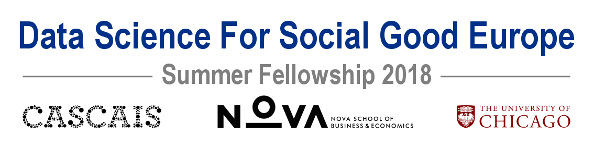
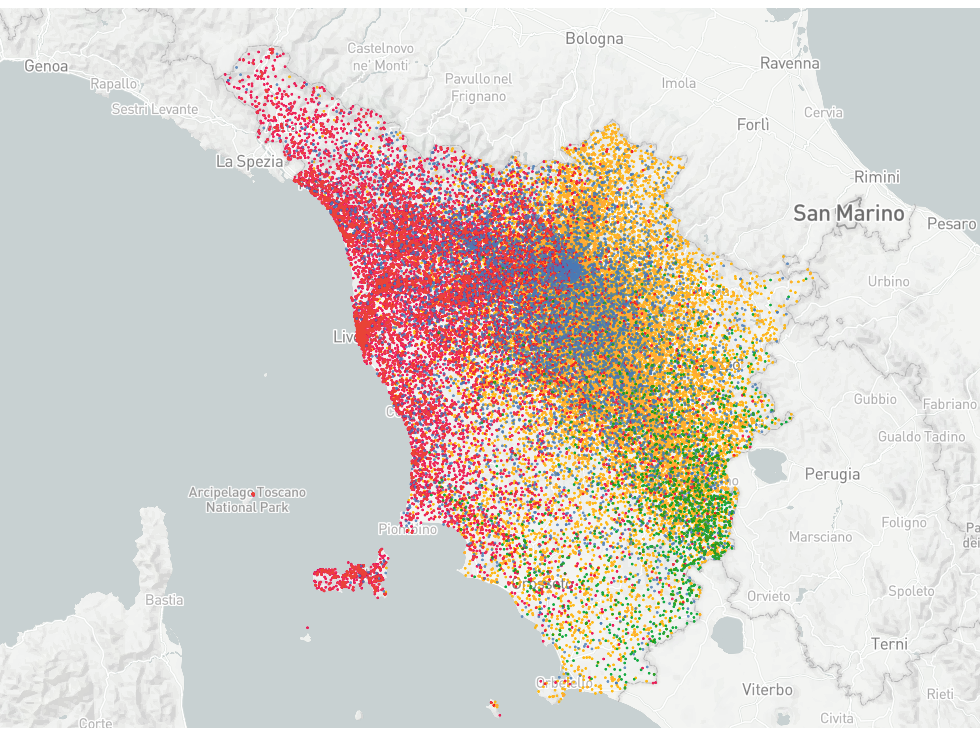
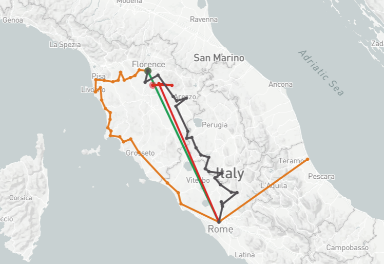
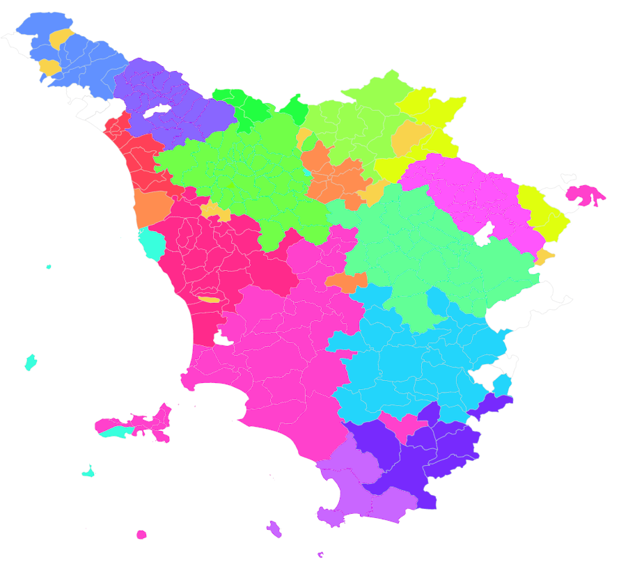

<p align="center">
  
</p>

# Data-Driven Planning for Sustainable Tourism in Tuscany

Project website with interactive visualizations: [Towards a More Sustainable Future of Tourism in Tuscany](http://dssg-eu.org/tuscany/index.html)

<p align="center">
  
</p>


## Project and Partners

Tuscany is one of the most visited tourist destinations on earth, but the popularity of the region brings about both benefits and challenges. Tourism accounts for a significant share of the GDP and economic growth of the region; meanwhile, overcrowding of tourists poses threats to the sustainability of the cultural heritage sites, the natural environment, as well as the quality of life of local residents. The management of the mobility of millions of Italian and foreign tourists that visit Tuscany every year is central to any policy that attempts to balance economic growth with environmental and social sustainability of this unique region. 

Our main partner, Toscana Promozione Turistica (TPT), is the Tuscany Regional Government Agency responsible for promoting tourism. Its main objective is to contribute to optimizing tourism flows throughout the region, thus consolidating Tuscany’s presence in traditional markets and developing it in emerging markets. We partner with the TPT to use data-driven approaches to understand classes of tourists and their mobility patterns, informing tourism policies that can be designed, implemented and tested by the public sector in Tuscany. 


## Main project Goal 

The main goal of this project is to provide insights and evidence of various tourist mobility patterns to the TPT in order to improve segmentation of the tourism markets, which ultimately leads to policies that optimizes the region's tourist mobility at the highest possible temporal-spatial resolution.


## Data and Modeling Approaches

The project is primarily based on data provided by Vodafone Italy and prepared by our project partner CS Research. The data contain telecom traces (IP Probe) of over 9.6 million anonymized foreign visitors roaming in Italy and detected by the Vodafone Italy network from May 2017 to February 2018. Telecom traces are available at the resolution of every minute when the visitor’s location changes (i.e., connected to different towers), and at every hour mark if the person remains static (i.e., remains connected to the same tower). At each timestamp, we have the lattitude and longitude of the cell tower that the visitor's device is connected to. This dataset allows us to track the movement of the visitor within Italy, particularly across Tuscany.

We use three clustering approaches to analyze tourist mobility patterns from different angles. Results from the three approaches can be compared and validated and thus provide a holistic picture of tourist movements. Please refer to the Readme files of each method for details:


* [geo2vec](/src/models/geo2vec/README.md)

* [kmeans](/src/models/kmeans/README.md)

* [sequence_analysis](/src/models/sequence_analysis/README.md)

## Getting Started with the Repo

### Directory structure

The project directory is structured into 10 main folders:
* `src/` includes source code for pipeline, feature analysis, data wrangling for visualizations, and our website report.
* `notebooks/` includes python notebooks for data exploration and analysis with descriptive text in a human readable format.
* `viz/` includes source code for visualizations.
* `docs/` includes documents and reports produced during the fellowship with early results and commentary.
* `dev/` includes development scripts which were used during the early development stages and are still in a rough format.
* `pipeline/` includes the pipeline for the models. The models should be run from this folder.
* `db/` includes SQL and python codes to transform data to formats ready for analysis and organize onto a database.
* `examples/` includes python notebooks of examples of analyses and output.
* `results/` includes final analyses outputs.
* `website/` includes all the website related files


```
TPT_tourism/
├── src/
|   ├── descriptives/
│   ├── models/
|   |   | |_geo2vec/
|   |   | |_kmeans/
|   |   | |_sequence_analysis/
|   ├── utils/
|   |   ├── connect_db/
|   |   ├── geolocation/
|   |   ├── load_data/
|   |   ├── read_shapefiles/
|   |   ├── sequence_analysis/
|
├── notebooks/
|   | |_<analysis_notebook>.ipynb
|   | |_ .../
|
├── viz/
|   | |_<visualizations>.py
|   | |_ .../
|
├── docs/
|   | |_Final Report.pdf
|
├── dev/
|   ├── SQL Scripts/
|
├── pipeline/
|   | |_<model_pipeline>.py
|   | |_ .../
|
├── db/
|   ├── ETL/
|   ├── SQL/
|   ├── location_features/
|
├── examples/
|   | |_<model_example>.ipynb
|   | |_ .../
|
├── results/
|   ├── country_season_results/
|
├── website/
|   | |_<css>/
|   | |_ .../
|
└── requirements.txt
```


### Installation guide

#### Installing git and forking the repo

Fork a copy of this repository onto your own GitHub account and `clone` your fork of the repository onto your computer, inside your favorite folder, using:

`git clone PATH_TO_FORKED_REPOSITORY`


#### Installing python and setting up the environment

[Install Python 3.6](https://www.python.org/downloads/release/python-360/) and the [conda package manager](https://conda.io/miniconda.html) (use miniconda, not anaconda, because we will install all the packages we need).
Navigate to the project directory inside a terminal and create a virtual environment (replace <environment_name>, for example, with "dssg_tuscany") and install the [required packages](https://github.com/dssg/TPT_tourism/blob/master/requirements.txt):

`conda create -n <environment_name> --file requirements.txt python=3.6`

Activate the virtual environment:

`source activate <environment_name>`

By installing these packages in a virtual environment, we avoid dependency clashes with other packages that may already be installed elsewhere on your computer.

#### Database

In order to access the database from Vodafone Italy, currently located on [AWS redshift](https://aws.amazon.com/redshift/) you need to add your credentials to the file `../utils/data_creds_redshift.json` (one level above the main folder where this repository was cloned). Those credentials are needed to run our SQL queries and retrieve the raw data, which will then be further processed and given as input to the three models. See [SQL](https://github.com/dssg/TPT_tourism/blob/master/db/README.md) for further details.

## Sample results

The results of the models are the interactive plots included in the website. Here we show sample snapshots of these results to ilustrate what the models can do.

### k-means (persona clusters)

k-means provides a visualization of how the different types of tourist personas are distributed in Tuscany.

<p align="center">
  
</p>

### Sequence analysis (trajectory clusters)

Sequence analysis provide sample trajectories for the different clusters.

<p align="center">
  
</p>

### Geo2vec (trajectory clusters)

geo2vec provide examples of municipalities that are commonly visited together.

<p align="center">
  
</p>


## Authors
This project was conducted as part of Data Science for Social Good (DSSG) Europe 2018 fellowship, further details of 
the twelve week summer fellowship can be found here:
https://dssg.uchicago.edu/europe/

**DSSG Fellows**: Bruno Del Papa, Kaushik Mohan, Orsolya Vasarhelyi, Yanbing Wang

**Project Manager**: Gabriele Simeone

**Technical Mentor**: Qiwei Han

## Acknowledgments

We would like to acknowledge all of the hard work of our partners, data partners, and mentors. Thank you to Alberto Peruzzini and Laura Morelli at Toscana Promozione Turistica for introducing us to the problem, and for coordinating dataset collection. Additionally, many thanks to the following organizations for making the following data open and available to us:


- Comune di Firenze, Assessorato al Turismo e Direzione Cultura.
- Toscana Aeroporti for the daily airport arrivals at the Florence airport.
- Uffici informazioni turistiche della Città Metropolitana di Firenze and Uffici Informazioni Turistiche del Comune di Firenze for the tourism office data.
- Istituto Regionale Programmazione Economica Toscana for the data from cruise ship arrivals in the Port of Livorno and their studies of tourism in Tuscany.
- Vodafone Italy and the Collective Sensing (CS) Research Foundation for providing and managing access to the Telecommunications data for Florence.
- Nova School of Business and Economics for its leadership to make this project possible, and all the logistic and other support during the project execution.
- Amazon Web Services for the Cloud for Research Credits.


*All​ ​analysis​ ​and​ ​opinions​ ​contained​ ​here​ ​are​ ​the​ ​authors’​ ​own,​ ​and​ ​are​ ​not​ ​necessarily​ ​held​ ​or
endorsed​ ​by​ ​any​ ​of​ ​the​ ​partners​ ​or​ ​data-providing​ ​agencies.*

## License
This project is licensed under the MIT License - see the LICENSE.md file for details


